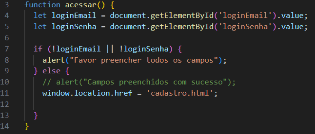
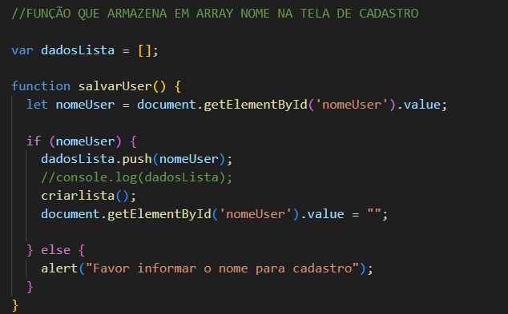
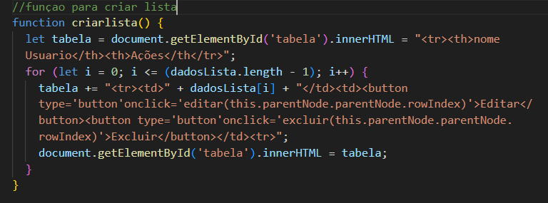
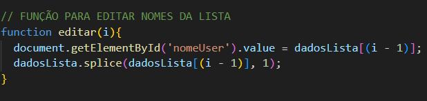
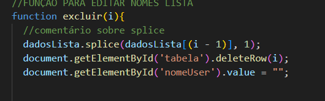

# Projeto - Sistema de cadastro com tela de login
## `` Detalhes ``
### ``Pagina login``
Em um contexto real, a página de login geralmente se conecta a um backend que valida as credenciais do usuário e determina se ele pode acessar o conteúdo protegido.

### ``Página cadastro``
Em uma implementação real, o formulário de cadastro estaria ligado a um backend que valida as informações, cria a conta no banco de dados e pode enviar um e-mail de confirmação ao usuário, e também tem um campo de email e nome.
 
 

### ``Descrição``

* 🥇 Esse sistema consiste em uma aplicação composta por duas telas básicas:

* login - Tela que permite ter acesso ao sistmea de cadastro;
* cadastro - Sistema que possibilita a realização de cadastros de usuários;

* 

* 🥈 Dados lista - Esse codígo permite que o usúario digite um nome em campo de texto, e ao clicar 
em um botão esse nome é dicionado a uma lista e exbido há página;
 
 * 

* 🥉 Criar lista - Este código cria dinamicamente uma tebela que exibe os nomes dos usúarios armazenados.
Para cada nome, são gerados botões que permitem editar e exluir o nome da lista

 * 

* 🏅 Editar nomes lista - O código cria uma lista não ordenada 
 com três itens, cada um contendo um nome, com um botão que chama a função "editar nomes".

 * 

 * 🏅Exluir nome lista - Ao digitar o nome no campo de texto e clicar no botão "exluir Nome", o item correspondente na lista será removido.

* 

### Resultado 🩷

<video width="320" height="240" controls>
  <source src="img/resultado.mp4" type="video/mp4">
</video>

